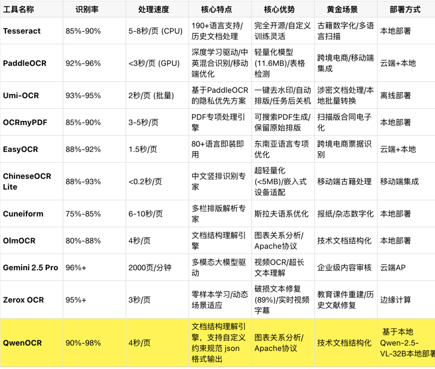

# Qwen-2.5-VL OCR API

这是一个基于通义千问2.5视觉语言模型(Qwen-2.5-VL-32B)的OCR识别API，使用FastAPI框架构建。

## 功能特点

- 基于通义千问2.5视觉语言大模型进行OCR文字识别
- 支持图像理解和多轮对话
- 提供符合OpenAPI规范的RESTful API接口
- 支持自定义提示词，提高识别精度


与11款主流工具的深度解析对比


## 安装与运行

### 环境要求

- Python 3.8+
- CUDA支持的GPU (推荐用于生产环境)

### 安装依赖

```bash
pip install -r requirements.txt